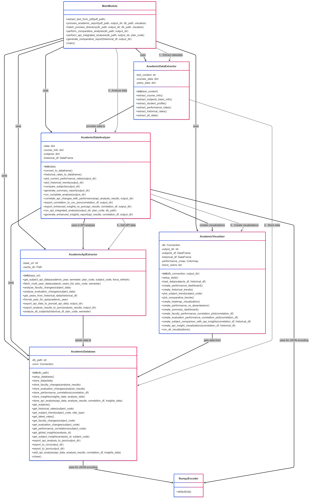
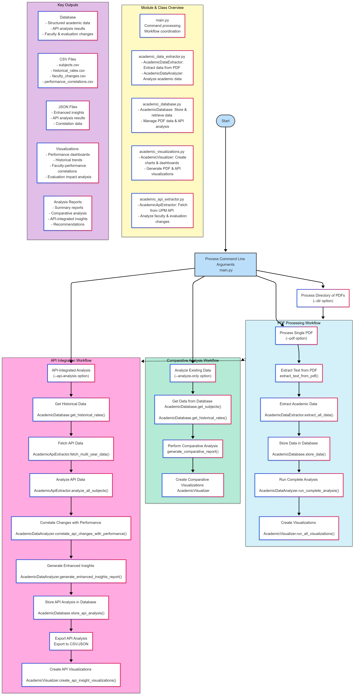

# Academic Data Analysis Project

This project provides a comprehensive solution for extracting, analyzing, and visualizing academic performance data from semester reports. It's specifically designed to work with PDF reports containing course information, student enrollment statistics, and performance metrics.

## Features

- **Data Extraction**: Extract structured data from semester report PDFs
- **API Integration**: Fetch and analyze data from the UPM academic API
- **Correlation Analysis**: Identify relationships between faculty changes, evaluation methods, and performance metrics
- **Data Storage**: Store extracted data in SQLite database for easy querying and analysis
- **Data Analysis**: Generate comprehensive analysis of academic performance
- **Visualization**: Create insightful plots and visuals of academic data
- **Trend Analysis**: Track performance trends across multiple semesters
- **Comparative Analysis**: Compare subjects based on various performance metrics
- **Report Generation**: Generate detailed summary reports with insights and recommendations

## Requirements

- Python 3.7 or higher
- Required Python packages:
  - pandas
  - matplotlib
  - seaborn
  - PyMuPDF
  - textract 
  - numpy
  - sqlite3 
  - requests
  - flask
  - flask-cors
  - scipy (for advanced statistical analysis)
  - pymannkendall (optional, for advanced trend analysis)

## Installation

1. Install required packages:

```bash
pip install pandas matplotlib seaborn PyMuPDF textract numpy requests flask flask-cors scipy
```

## Project Structure

```
academic_analysis/
├── academic_data_extractor.py  # Extract data from PDF text
├── academic_database.py        # SQLite database functionality
├── academic_api_extractor.py   # Fetch and analyze data from UPM API
├── academic_visualizations.py  # Advanced visualization functions
├── academic_api.py               # REST API for web integration
├── main.py                     # Main program and CLI interface
└── README.md                   # This documentation file
```

## Usage

### Command Line Interface

The project provides a command-line interface for usage:

```bash
python main.py --pdf path/to/report.pdf --output results
```

#### Command Line Options

- `--pdf PATH`: Process a single PDF report
- `--dir PATH`: Process all PDF reports in a directory
- `--output PATH`: Specify output directory (default: "output")
- `--db PATH`: Specify SQLite database path (default: "academic_data.db")
- `--no-viz`: Skip generating visualizations
- `--analyze-only`: Only perform analysis on existing database
-  `--api-analysis`: Perform analysis with API integration
-  `--plan-code CODE`: Specify the academic plan code for API requests (default: "10II")

### Examples

#### Process a single report

```bash
python main.py --pdf reports/IS_10II_2023-24.pdf --output results/2023-24
```


#### Perform API-integrated analysis using the processed data of the reports

```bash
python main.py --api-analysis --db academic_data.db --output api_results --plan-code 10II
```

#### Process multiple reports

```bash
python main.py --dir reports/ --output all_results
```

#### Analyze existing database without processing PDFs

```bash
python main.py --analyze-only --db academic_data.db --output analysis_results
```

### Starting the REST API Server

To make your academic data available through a REST API for web applications:

```bash
python rest-api.py --db academic_data.db --port 5000
```

#### API Server Options

- `--db PATH`: Path to SQLite database (default: "academic_data.db")
- `--port PORT`: Port to run the API server on (default: 5000)
- `--host HOST`: Host to run the API server on (default: 127.0.0.1)
- `--debug`: Run in debug mode

## REST API Endpoints

The REST API provides access to all analysis data stored in the database. All endpoints are prefixed with `/api/v1`.

### Basic Data Endpoints

- **GET /api/v1/subjects**: Get all subjects
  - Query parameters: `academic_year`, `semester`

- **GET /api/v1/subjects/{subject_code}**: Get detailed information about a specific subject
  - Query parameters: `academic_year`

- **GET /api/v1/subjects/{subject_code}/historical**: Get historical performance data for a subject
  - Query parameters: `rate_type`

- **GET /api/v1/performance/summary**: Get summary of performance metrics
  - Query parameters: `academic_year`

### API Analysis Endpoints

- **GET /api/v1/faculty/changes**: Get faculty changes data
  - Query parameters: `subject_code`

- **GET /api/v1/evaluation/changes**: Get evaluation method changes data
  - Query parameters: `subject_code`

- **GET /api/v1/correlations**: Get correlations between changes and performance
  - Query parameters: `subject_code`, `faculty_changed`, `evaluation_changed`

### Insights Endpoints

- **GET /api/v1/insights/global**: Get global insights from the most recent analysis

- **GET /api/v1/insights/subjects**: Get subject-specific insights
  - Query parameters: `subject_code`, `analysis_id`

### Advanced Analysis Endpoints

- **GET /api/v1/advanced/trend-analysis**: Get results from advanced trend analysis
  - Query parameters: `subject_code`, `significant_only`

### Utility Endpoints

- **GET /api/v1/stats**: Get database statistics

## Example API Requests

### Get all subjects from a specific academic year

```
GET http://localhost:5000/api/v1/subjects?academic_year=2023-24
```

### Get historical data for a specific subject

```
GET http://localhost:5000/api/v1/subjects/105000005/historical
```

### Get performance correlation data for subjects with faculty changes

```
GET http://localhost:5000/api/v1/correlations?faculty_changed=true
```

### Get global insights from the latest analysis

```
GET http://localhost:5000/api/v1/insights/global
```

## Output

The tool generates various outputs organized in directories:

- **CSV and JSON Files**: Extracted data in structured formats
- **Analysis Reports**: Text reports with insights and observations
- **Visualizations**: Charts and graphs visualizing performance metrics:
  - Performance rates comparison
  - Success rates comparison
  - Absenteeism rates analysis
  - Historical trends
  - Subject comparisons
  - Performance dashboards
  - Faculty-performance correlation visualizations
  - Evaluation-performance correlation visualizations
  
- **Enhanced Reports**: API-integrated analysis reports:
  - Faculty change impact analysis
  - Evaluation methods impact analysis
  - Correlation between academic changes and performance

## Example Workflow

1. **Extract Data**: Process PDF reports to extract academic performance data
2. **Store Data**: Save extracted data in SQLite database
3. **Fetch API Data**: Retrieve faculty and evaluation information from the UPM API
4. **Correlate Changes**: Identify relationships between faculty/evaluation changes and performance trends
5. **Analyze Data**: Generate comprehensive analysis of performance metrics
6. **Visualize Results**: Create charts and dashboards to visualize insights
7. **Generate Reports**: Produce detailed reports with recommendations
8. **Track Trends**: Monitor performance trends across semesters


## API Integration Details

The new API integration component connects to the UPM academic API to fetch detailed information about subjects, including:

- Faculty information (professors teaching each subject)
- Evaluation methods and activities
- Curriculum details

The system analyzes changes in these elements across academic years and correlates them with performance metrics to identify potential causative relationships.

### API Endpoint Format

The toolkit accesses the UPM API using the following URL pattern:
```
https://www.upm.es/comun_gauss/publico/api/{academic_year}/{semester}/{plan_code}_{subject_code}.json
```

For example:
```
https://www.upm.es/comun_gauss/publico/api/2022-23/2S/10II_105000005.json
```

### Correlation Analysis

The toolkit performs the following correlation analyses:

1. **Faculty Change Impact**: Evaluates how changes in teaching staff correlate with changes in performance metrics
2. **Evaluation Method Impact**: Assesses the relationship between changes in evaluation methods and student performance
3. **Trend Analysis**: Identifies patterns across subjects where similar changes produce similar outcomes

## Enhanced Insights

The API-integrated analysis generates enhanced insights such as:

- Identification of potential causative factors for performance changes
- Recommendations for faculty assignments based on historical performance
- Evaluation method effectiveness analysis
- Identification of best practices that could be applied across courses

# Academic Data Analysis Project

This project provides a comprehensive solution for extracting, analyzing, and visualizing academic performance data from semester reports. It's specifically designed to work with PDF reports containing course information, student enrollment statistics, and performance metrics.

## Features

- **Data Extraction**: Extract structured data from semester report PDFs
- **API Integration**: Fetch and analyze data from the UPM academic API
- **Correlation Analysis**: Identify relationships between faculty changes, evaluation methods, and performance metrics
- **Data Storage**: Store extracted data in SQLite database for easy querying and analysis
- **Data Analysis**: Generate comprehensive analysis of academic performance
- **Visualization**: Create insightful plots and visuals of academic data
- **Trend Analysis**: Track performance trends across multiple semesters
- **Comparative Analysis**: Compare subjects based on various performance metrics
- **Report Generation**: Generate detailed summary reports with insights and recommendations

## Requirements

- Python 3.7 or higher
- Required Python packages:
  - pandas
  - matplotlib
  - seaborn
  - PyMuPDF
  - textract 
  - numpy
  - sqlite3 
  - requests
  - pymannkendall

## Installation

1. Install required packages:

```bash
pip install pandas matplotlib seaborn PyMuPDF textract numpy requests pymannkendall
```

## Project Structure

```
academic_analysis/
├── academic_data_extractor.py  # Extract data from PDF text
├── academic_database.py        # SQLite database functionality
├── academic_api_extractor.py   # Fetch and analyze data from UPM API
├── academic_visualizations.py  # Advanced visualization functions
├── advanced_statistical_analysis.py  # Advanced statistical methods
├── main.py                     # Main program and CLI interface
└── README.md                   # This documentation file
```

## Project Flowchart



## Usage

### Command Line Interface

The project provides a command-line interface for usage:

```bash
python main.py --pdf path/to/report.pdf --output results
```

#### Command Line Options

- `--pdf PATH`: Process a single PDF report
- `--dir PATH`: Process all PDF reports in a directory
- `--output PATH`: Specify output directory (default: "output")
- `--db PATH`: Specify SQLite database path (default: "academic_data.db")
- `--no-viz`: Skip generating visualizations
- `--analyze-only`: Only perform analysis on existing database
-  `--api-analysis`: Perform analysis with API integration
-  `--plan-code CODE`: Specify the academic plan code for API requests (default: "10II")

### Examples

#### Process a single report

```bash
python main.py --pdf reports/IS_10II_2023-24.pdf --output results/2023-24
```


#### Perform API-integrated analysis using the processed data of the reports

```bash
python main.py --api-analysis --db academic_data.db --output api_results --plan-code 10II
```

#### Process multiple reports

```bash
python main.py --dir reports/ --output all_results
```

#### Analyze existing database without processing PDFs

```bash
python main.py --analyze-only --db academic_data.db --output analysis_results
```

### Starting the REST API Server

To make your academic data available through a REST API for web applications:

```bash
python rest-api.py --db academic_data.db --port 5000
```

#### API Server Options

- `--db PATH`: Path to SQLite database (default: "academic_data.db")
- `--port PORT`: Port to run the API server on (default: 5000)
- `--host HOST`: Host to run the API server on (default: 127.0.0.1)
- `--debug`: Run in debug mode

## REST API Endpoints

The REST API provides access to all analysis data stored in the database. All endpoints are prefixed with `/api/v1`.

### Basic Data Endpoints

- **GET /api/v1/subjects**: Get all subjects
  - Query parameters: `academic_year`, `semester`

- **GET /api/v1/subjects/{subject_code}**: Get detailed information about a specific subject
  - Query parameters: `academic_year`

- **GET /api/v1/subjects/{subject_code}/historical**: Get historical performance data for a subject
  - Query parameters: `rate_type`

- **GET /api/v1/performance/summary**: Get summary of performance metrics
  - Query parameters: `academic_year`

### API Analysis Endpoints

- **GET /api/v1/faculty/changes**: Get faculty changes data
  - Query parameters: `subject_code`

- **GET /api/v1/evaluation/changes**: Get evaluation method changes data
  - Query parameters: `subject_code`

- **GET /api/v1/correlations**: Get correlations between changes and performance
  - Query parameters: `subject_code`, `faculty_changed`, `evaluation_changed`

### Insights Endpoints

- **GET /api/v1/insights/global**: Get global insights from the most recent analysis

- **GET /api/v1/insights/subjects**: Get subject-specific insights
  - Query parameters: `subject_code`, `analysis_id`

### Advanced Analysis Endpoints

- **GET /api/v1/advanced/trend-analysis**: Get results from advanced trend analysis
  - Query parameters: `subject_code`, `significant_only`

### Utility Endpoints

- **GET /api/v1/stats**: Get database statistics

## Example API Requests

### Get all subjects from a specific academic year

```
GET http://localhost:5000/api/v1/subjects?academic_year=2023-24
```

### Get historical data for a specific subject

```
GET http://localhost:5000/api/v1/subjects/105000005/historical
```

### Get performance correlation data for subjects with faculty changes

```
GET http://localhost:5000/api/v1/correlations?faculty_changed=true
```

### Get global insights from the latest analysis

```
GET http://localhost:5000/api/v1/insights/global
```


## Output

The tool generates various outputs organized in directories:

- **CSV and JSON Files**: Extracted data in structured formats
- **Analysis Reports**: Text reports with insights and observations
- **Visualizations**: Charts and graphs visualizing performance metrics:
  - Performance rates comparison
  - Success rates comparison
  - Absenteeism rates analysis
  - Historical trends
  - Subject comparisons
  - Performance dashboards
  - Faculty-performance correlation visualizations
  - Evaluation-performance correlation visualizations
  
- **Enhanced Reports**: API-integrated analysis reports:
  - Faculty change impact analysis
  - Evaluation methods impact analysis
  - Correlation between academic changes and performance

## Example Workflow

1. **Extract Data**: Process PDF reports to extract academic performance data
2. **Store Data**: Save extracted data in SQLite database
3. **Fetch API Data**: Retrieve faculty and evaluation information from the UPM API
4. **Correlate Changes**: Identify relationships between faculty/evaluation changes and performance trends
5. **Analyze Data**: Generate comprehensive analysis of performance metrics
6. **Visualize Results**: Create charts and dashboards to visualize insights
7. **Generate Reports**: Produce detailed reports with recommendations
8. **Track Trends**: Monitor performance trends across semesters



## API Integration Details

The new API integration component connects to the UPM academic API to fetch detailed information about subjects, including:

- Faculty information (professors teaching each subject)
- Evaluation methods and activities
- Curriculum details

The system analyzes changes in these elements across academic years and correlates them with performance metrics to identify potential causative relationships.

### API Endpoint Format

The toolkit accesses the UPM API using the following URL pattern:
```
https://www.upm.es/comun_gauss/publico/api/{academic_year}/{semester}/{plan_code}_{subject_code}.json
```

For example:
```
https://www.upm.es/comun_gauss/publico/api/2022-23/2S/10II_105000005.json
```

### Correlation Analysis

The toolkit performs the following correlation analyses:

1. **Faculty Change Impact**: Evaluates how changes in teaching staff correlate with changes in performance metrics
2. **Evaluation Method Impact**: Assesses the relationship between changes in evaluation methods and student performance
3. **Trend Analysis**: Identifies patterns across subjects where similar changes produce similar outcomes

## Enhanced Insights

The API-integrated analysis generates enhanced insights such as:

- Identification of potential causative factors for performance changes
- Recommendations for faculty assignments based on historical performance
- Evaluation method effectiveness analysis
- Identification of best practices that could be applied across courses

## Data Analysis Framework

The academic analysis project implements a comprehensive analytical framework that combines data from two primary sources: extracted PDF reports and the UPM API. Now explains the methodological approach, statistical techniques, and visualization strategies employed in the system.

## 1. Basic Analysis of Extracted PDF Data

### 1.1 Performance Metrics Calculation

The system extracts and analyzes three fundamental academic performance metrics from PDF reports:

1. **Performance Rate**: Represents the percentage of students who passed the course relative to the total number of enrolled students.
   - Formula: `(Students who passed / Total enrolled students) × 100`
   - Interpretation: Higher values indicate better overall performance

2. **Success Rate**: Measures the percentage of students who passed the course relative to those who participated in evaluations.
   - Formula: `(Students who passed / Students who participated) × 100`
   - Interpretation: Higher values indicate better effectiveness among participating students

3. **Absenteeism Rate**: Represents the percentage of students who did not participate in evaluations.
   - Formula: `(Students who did not participate / Total enrolled students) × 100`
   - Interpretation: Lower values are generally preferred

### 1.2 Statistical Analysis of Current Performance

For current performance analysis, the system calculates:

- **Mean values** for each metric across all subjects
- **Minimum and maximum values** to identify outliers
- **Standard deviation** to measure variability between subjects
- **Quartile analysis** to categorize subjects into performance bands:
  - Very Low (0-30%)
  - Low (30-50%)
  - Average (50-70%)
  - High (70-90%)
  - Excellent (90-100%)

### 1.3 Historical Trend Analysis

For historical data, the system performs:

1. **Year-to-Year Change Analysis**:
   - Absolute change: `Metric(Year2) - Metric(Year1)`
   - Relative change: `(Metric(Year2) - Metric(Year1)) / Metric(Year1) × 100`

2. **Trend Categorization**:
   - **Improving**: Positive change greater than 1 percentage point
   - **Stable**: Change between -1 and +1 percentage points
   - **Declining**: Negative change greater than 1 percentage point

3. **Long-term Trend Analysis**:
   - Linear regression to establish trend lines
   - Calculation of slope to quantify the rate of change
   - R-squared values to measure how well the trend fits the data

## 2. API Data Analysis

### 2.1 Faculty Change Analysis

The system analyzes changes in teaching staff over time by:

1. **Extracting Faculty Data**:
   - Retrieving professor lists from the UPM API for each subject and academic year
   - Creating sets of faculty members for each year

2. **Measuring Faculty Changes**:
   - Identifying added faculty members: `Faculty(Year2) - Faculty(Year1)`
   - Identifying removed faculty members: `Faculty(Year1) - Faculty(Year2)`
   - Calculating total added: `len(added_faculty)`
   - Calculating total removed: `len(removed_faculty)`

3. **Quantifying Change Magnitude**:
   - Percent changed: `(len(added_faculty) + len(removed_faculty)) / max(1, len(Faculty(Year1))) × 100`
   - This metric represents the relative magnitude of faculty turnover

### 2.2 Evaluation Method Analysis

The system analyzes changes in evaluation methods by:

1. **Extracting Evaluation Methods**:
   - Retrieving evaluation activities from the UPM API for each subject and academic year
   - Creating sets of evaluation method types for each year

2. **Measuring Evaluation Changes**:
   - Identifying added methods: `Methods(Year2) - Methods(Year1)`
   - Identifying removed methods: `Methods(Year1) - Methods(Year2)`
   - Generating a binary "changed" flag if any additions or removals are detected

## 3. Correlation Analysis Between Changes and Performance

### 3.1 Faculty-Performance Correlation

The system correlates faculty changes with performance metrics through:

1. **Pair-wise Analysis**:
   - For each subject and consecutive year pair (Year1, Year2):
     - Calculate performance change: `Performance(Year2) - Performance(Year1)`
     - Determine if faculty changed between these years
     - Calculate the magnitude of faculty change (percent changed)

2. **Correlation Metrics**:
   - **Mean Performance Change with Faculty Changes**:
     - Average performance change for periods with faculty changes
   - **Mean Performance Change without Faculty Changes**:
     - Average performance change for periods with stable faculty
   - **Impact Assessment**:
     - Difference between these means: `Change_with - Change_without`
     - Positive values suggest faculty changes correlate with improvement
     - Negative values suggest faculty stability correlates with improvement

3. **Statistical Significance**:
   - For subjects with sufficient data points:
     - T-test to determine if the difference between means is statistically significant
     - P-value < 0.05 suggests a statistically significant correlation

### 3.2 Evaluation Method-Performance Correlation

Similar to faculty analysis, the system correlates evaluation method changes with performance:

1. **Pair-wise Analysis**:
   - For each subject and consecutive year pair:
     - Calculate performance change
     - Determine if evaluation methods changed

2. **Correlation Metrics**:
   - Mean performance change with evaluation changes
   - Mean performance change without evaluation changes
   - Impact assessment (difference between means)

### 3.3 Determination of Impact Type

The system categorizes the impact of changes using these rules:

1. **Faculty Impact Categorization**:
   - **Positive Impact**: When periods with faculty changes show performance improvement at least 2 percentage points higher than periods without changes
   - **Negative Impact**: When periods with faculty changes show performance decline or improvement at least 2 percentage points lower than periods without changes
   - **Neutral Impact**: When the difference is less than 2 percentage points

2. **Evaluation Impact Categorization**:
   - Similar thresholds apply for evaluation method changes

## 4. Insight Generation

### 4.1 Subject-Specific Insights

For each subject, the system generates insights by:

1. **Trend Direction Analysis**:
   - Calculates average performance change across all analyzed periods
   - Classifies the subject as "improving," "declining," or "stable"

2. **Faculty Change Impact Analysis**:
   - Compares performance during periods with faculty changes vs. periods without
   - Generates insights about whether faculty changes benefit this specific subject

3. **Evaluation Change Impact Analysis**:
   - Identifies if evaluation method changes correlate with performance improvements
   - Generates specific insights about evaluation effectiveness

4. **Critical Period Identification**:
   - Identifies periods with significant performance changes (>5 percentage points)
   - Analyzes what factors (faculty, evaluation, or other) might explain these changes

### 4.2 Global Insights

Across all subjects, the system generates institution-wide insights:

1. **Faculty Management Insights**:
   - Determines whether faculty renewal or stability is generally beneficial
   - Identifies departments or subject areas where faculty changes have the most impact

2. **Evaluation Strategy Insights**:
   - Evaluates whether innovation in evaluation methods correlates with better outcomes
   - Recommends strategies for evaluation method improvements

3. **Recommendation Generation**:
   - Based on correlation patterns, generates specific recommendations for faculty management, evaluation methods, and curriculum development

## 5. Visualization Strategy

Each visualization in the system serves a specific analytical purpose:

### 5.1 Performance Dashboards

**Purpose**: Provide a comprehensive overview of current academic performance.

**Visualizations Include**:
- **Horizontal Bar Charts for Performance Rates**: Allow easy comparison between subjects
  - Color-coded using red-yellow-green scale for intuitive assessment
  - Sorted by performance rate for quick identification of high/low performers
  
- **Success Rate Comparison Charts**: Compare performance rate with success rate
  - Highlight the gap between these metrics to identify potential intervention areas
  
- **Absenteeism Heat Maps**: Visualize patterns of student non-participation
  - Identify subjects with concerning absenteeism levels

### 5.2 Historical Trend Visualizations

**Purpose**: Analyze performance evolution over time.

**Visualizations Include**:
- **Line Charts for Metric Trends**: Track changes in performance, success, and absenteeism rates
  - Include trend lines to highlight direction
  - Use consistent color coding (e.g., green for performance, blue for success, red for absenteeism)
  
- **Year-to-Year Change Bar Charts**: Visualize annual changes
  - Highlight significant improvements or declines
  
- **Heat Maps Across Years**: Show patterns and potential correlations
  - Identify trends that might not be obvious in line charts

### 5.3 Faculty-Performance Correlation Visualizations

**Purpose**: Visualize relationships between faculty changes and performance metrics.

**Visualizations Include**:
- **Scatter Plots**: Plot faculty change percentage against performance change
  - Quadrant analysis to categorize relationships:
    - High faculty change + performance improvement
    - High faculty change + performance decline
    - Low faculty change + performance improvement
    - Low faculty change + performance decline
  
- **Comparative Bar Charts**: Compare average performance change with and without faculty changes
  - Statistical significance indicators where applicable
  
- **Subject Comparison with Faculty Change Indicators**: Show which subjects benefited or suffered from faculty changes
  - Color-coded to highlight patterns

### 5.4 Evaluation Method Correlation Visualizations

**Purpose**: Analyze impact of evaluation method changes on student performance.

**Visualizations Include**:
- **Bar Charts Comparing Performance With/Without Changes**: Direct comparison of impact
  - Statistical significance indicators
  
- **Combined Faculty and Evaluation Impact Charts**: Analyze the interaction between both factors
  - Identify which combination produces optimal results

### 5.5 Summary Dashboards

**Purpose**: Provide executive-level insights and recommendations.

**Visualizations Include**:
- **Key Metrics Overview**: Summary of most important findings
  - Average performance metrics
  - Number of subjects improving/declining
  - Most significant correlations
  
- **Recommendations Visualization**: Present actionable recommendations
  - Prioritized by potential impact
  - Color-coded by difficulty of implementation
  
- **Comparative Analysis Dashboard**: Compare different academic years
  - Show progress toward institutional goals

## 6. Theoretical Basis for Improvement and Decline Determination

The determination of improvement and decline is based on some theoretical frameworks:

### 6.1 Absolute vs. Relative Change

- **Absolute Change**: Raw percentage point difference between years
  - Used for direct comparison between subjects
  - Primary metric for straightforward analysis
  
- **Relative Change**: Percentage change relative to previous value
  - Used when comparing subjects with vastly different baseline metrics
  - Provides context for the magnitude of change

### 6.2 Statistical Significance

- **T-tests**: Used to determine if observed differences are statistically significant
  - Applied when sufficient data points are available
  - P-value threshold of 0.05 used as standard significance level
  
- **Effect Size**: Cohen's d calculation to determine practical significance
  - Small effect: 0.2
  - Medium effect: 0.5
  - Large effect: 0.8

### 6.3 Threshold Selection for Change Classification

The threshold of ±1 percentage point for stable performance and ±2 percentage points for correlation impact is based on:

1. **Educational Literature**: Research on meaningful change in academic performance metrics
2. **Historical Data Analysis**: Analysis of natural fluctuations in the dataset
3. **Practical Significance**: Levels of change that would warrant intervention

### 6.4 Multi-year Trend Analysis

For subjects with 3+ years of data, the system applies:

- **Linear Regression**: To establish the overall direction and rate of change
- **Mann-Kendall Test**: To determine if there is a consistent trend
- **Theil-Sen Estimator**: For robust trend line fitting that's less sensitive to outliers

